# 从 Agent 过程观测到 AePis

## 设计背景与动机

### 结果导向难以解释 Agent 的真实能力

目前的自动化渗透测试benchmark多使用是否获得 Flag、是否通过 Judge、是否完成漏洞验证来评价 Agent。短期来看，这些结果指标是必要的，因为它们为不同系统提供了相对客观的比较锚点；但随着 Agent 从单轮回答发展为能够调用终端、浏览器、扫描器和漏洞验证工具的长链路执行系统，仅凭最终结果已经难以描述其真实能力。

在此之前我们发表了一篇论文 [《Hackers or Hallucinators? A Comprehensive Analysis of LLM-Based Automated Penetration Testing》](https://arxiv.org/pdf/2604.05719)对 13 个开源自动化渗透测试框架和 2 个基线框架的统一测评中，我们没有找到一种始终占优的 Agent 架构，反而观察到多组非单调现象：架构更加复杂，不一定表现更好；知识和工具更多，也不一定带来稳定收益；多 Agent 可以通过并行探索扩大攻击面，也可能因为角色冲突、信息丢失和记忆碎片化增加额外负担。同一种设计可能在一个场景中形成优势，却在另一个场景中成为负担。

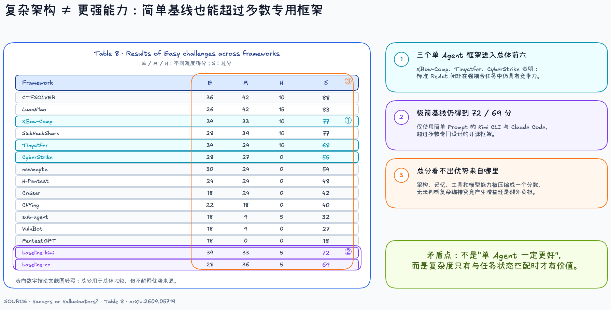

图：统一测评中的架构复杂度与任务表现。简单基线同样能够超过多数专用框架，总分本身不能解释优势来自哪里。

知识库消融实验进一步说明，这种非单调关系不仅存在于 Agent 编排，也存在于知识与工具层。相同的知识库组件在不同框架中可能形成增益，也可能干扰当前攻击路径；问题不是简单地选择“要不要知识库”，而是判断什么时候检索什么内容，以及如何验证检索结果是否真正推动任务。

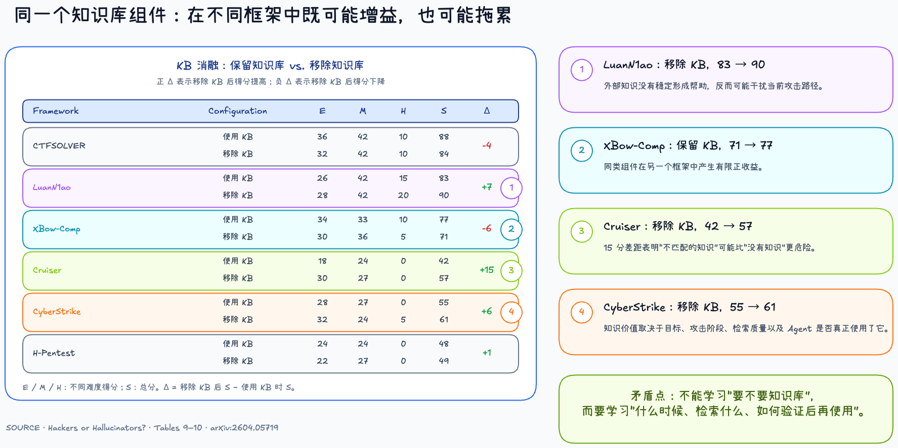

图：相同知识库组件可能增益，也可能拖累。知识价值取决于任务阶段、检索质量以及 Agent 是否正确使用它。

这说明自动化渗透测试真正需要回答的，并不是“哪一种 Agent 架构最好”，而是：什么任务状态适合什么行为方式，哪些证据需要被保留，什么时候应该继续利用、切换策略、调用外部知识或派生 Subagent。只根据总分固化一套编排，会把“某种方法在某类任务中有效”误写成“所有任务都应该采用这种方法”。

现有 Benchmark 的主要问题由此显现出来：一次运行可能包含几十个模型 Turn、数百次工具交互以及大量目标响应，最终却通常只被压缩为成功或失败。结果可以用于排行，却没有保留足够的过程信息来支持诊断和改进。

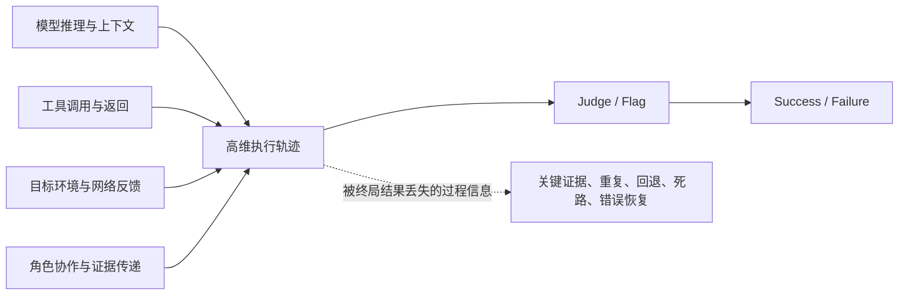

当 Agent 的运行吞吐量不断提高时，这种信息压缩还会形成新的反馈瓶颈：Agent 可以并行执行、持续重试并快速产生大量轨迹，但人仍然需要逐条阅读日志、重新理解上下文并手工调整 Prompt、Skill、工具或编排。系统扩展的上限逐渐不再是 Agent 能运行多少次，而是人能够分析多少次。

### 为什么只看结果不够

相同的最终结果，可能对应完全不同的能力状态。一次成功可能来自清晰、稳定且可复现的攻击路径，也可能来自大量无效探索后的偶然命中；一次失败可能意味着 Agent 没有发现漏洞，也可能意味着它已经获得关键证据，却在 Payload 构造、结果验证或上下文交接阶段中断。

此前测评中的 Challenge 026 展示了这种差异。在 30 份运行样本中，22 份最终都被记录为失败，但人工复盘后可以进一步分为两类：5 份样本已经看到目标版本，却没有完成从版本信息到 CVE 的关联；另外 17 份已经识别出正确 CVE，只是没有构造出有效 Payload。前者需要改进漏洞知识关联，后者需要改进 PoC 获取、编码转义和环境适配。如果只保留失败标签，这两种完全不同的能力瓶颈会得到相同反馈。

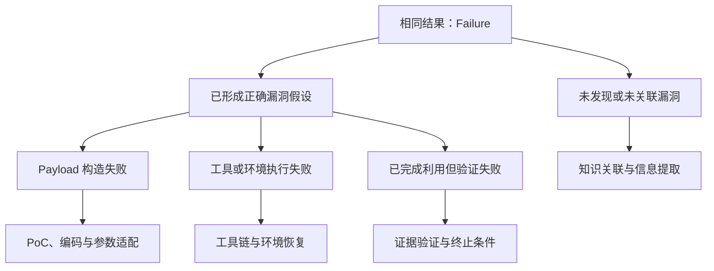

XUANJIAN 观测平台的固定审计案例进一步展示了过程证据如何把相同失败映射为不同修改方向。Attempt 60 和 Attempt 65 最终都没有通过 Judge，但前者断在“关键证据进入后续行动”的交接位置，后者断在“重复行动收敛到环境验证”的位置。仅看失败无法区分这两个断点；恢复过程结构后，才能分别提出证据检查点、上下文 handoff、停滞检测和强制回退等修改。

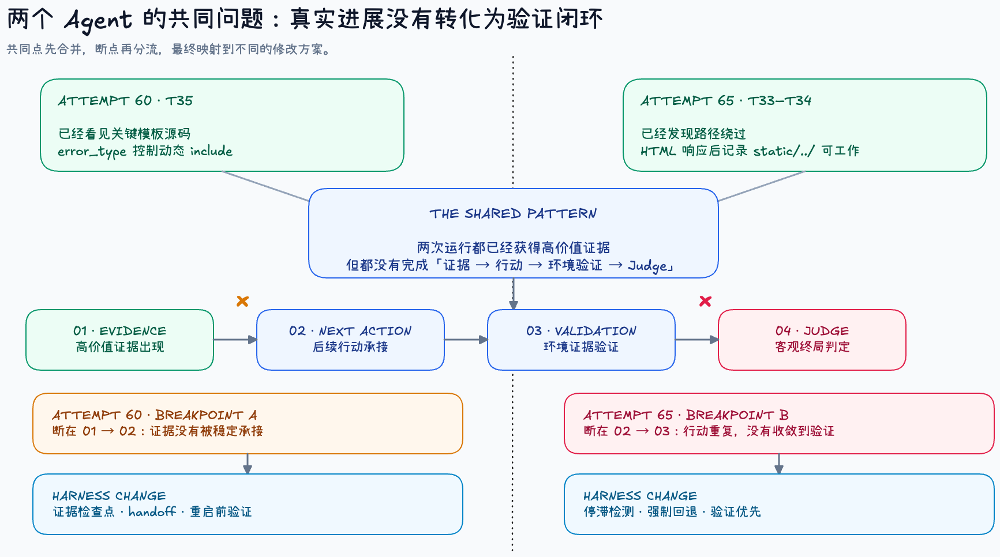

图：两次运行都获得了高价值证据，却分别在证据承接和策略收敛阶段中断，因此需要不同的 Harness 修改。

同样，成功也不必然代表稳定能力。多个并发分支偶然组合出完整攻击链，与 Agent 持续保留关键证据、按因果关系推进利用，在最终结果中都可能显示为成功，但二者的可复现性、路径效率和迁移价值并不相同。

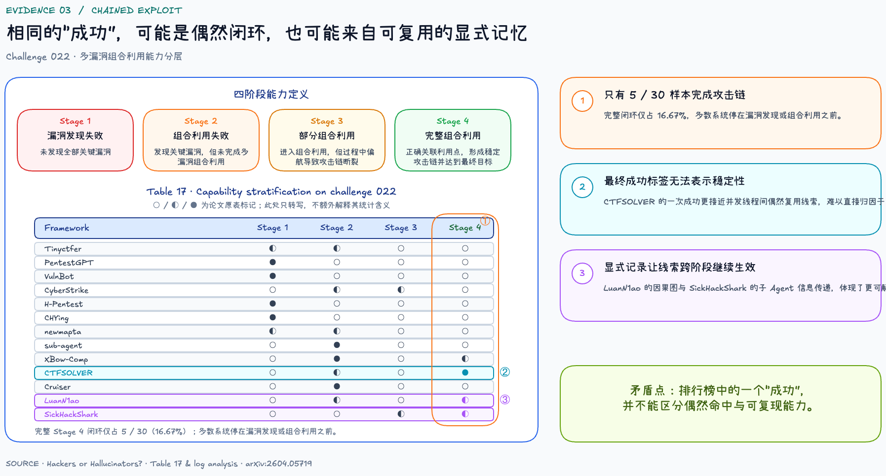

图：相同的成功标签可能来自偶然闭环，也可能来自可复用的显式记忆和稳定证据传递。

因此，过程评估需要在结果之外继续回答：Agent 执行了什么动作，获得了什么环境反馈，哪些证据被后续行为使用，在哪里出现重复或策略震荡，失败后是否发生有效恢复，以及最终结论是否得到了工具、环境和 Judge 的共同支持。只有把这些问题映射到具体 Turn、工具调用和环境证据，反馈才能进一步指向可执行的 Harness 修改。

### 通用 Agent Harness 的可观测性困境

不同 Agent Harness 使用不同方式组织执行过程。Codex、Claude Code 一类 Code Agent 主要通过终端、文件和工具调用推进任务；状态图框架通过节点和状态流转组织过程；多 Agent 系统则依赖角色通信、任务分发和共享记忆。它们对于上下文、计划、工具、记忆和子任务的表达方式并不一致。

在不修改 Runtime 的情况下，观测系统通常只能依赖框架公开的 Hook、回调或日志。这种方式侵入性较低，却可能看不到模型实际接收的上下文、参数校验前后的变化、工具真实结果与 Hook 修改后的结果，也难以稳定关联父 Agent 的推理轮次、Subagent 的独立执行过程以及结果重新进入 Main Agent 上下文的边界。

另一种方式是在每一种 Agent 实现内部增加专用观测逻辑。它可以获得更多细节，但也容易使观测代码与推理循环、工具系统、MCP、Skill 和 Subagent 编排高度耦合。每增加一种能力，都需要同步设计新的采集入口；上游 Runtime 发生变化时，观测层也必须跟随内部实现调整。

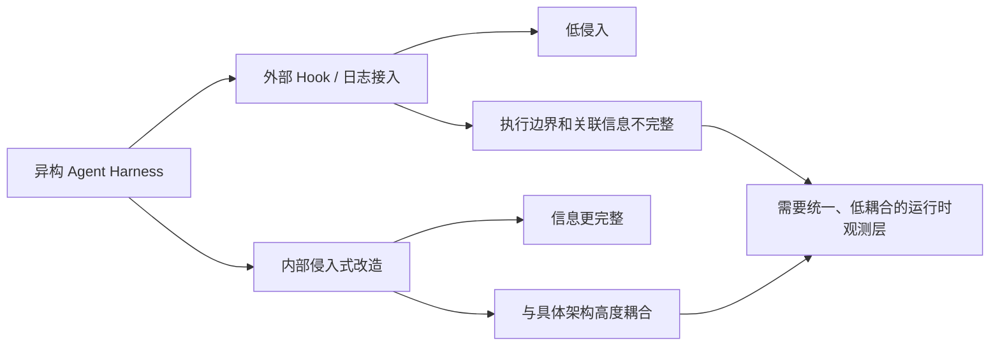

因此，需要统一的不是 Agent 的内部实现，而是跨框架分析所需的最小行为语义：Agent 面对什么目标，执行了什么动作，获得了什么结果，是否使用了已有证据，如何从失败中恢复，以及最终结论是否得到环境和 Judge 支持。不同 Agent 可以继续保留自己的执行架构和记忆方式，但其可观测过程应能够被转换为统一、细粒度且可比较的过程数据。

### 从行为可观测到 AePis

#### XUANJIAN 观测平台中的 Agent 过程观测

我们首先在 XUANJIAN 自动化渗透测试观测平台中落地 Agent 的可观测链路。平台位于 [http://aegismind.top/](http://aegismind.top/)，面向自动化渗透测试任务，将 Agent 运行、工具调用、目标环境反馈、网络流量和 Judge 结果组织到同一条过程链中，并提供运行记录、关键证据检查和 Agent Process Graph 展示。Pentest-range 中形成的测评与过程观测能力，在这里以 XUANJIAN 平台的形式对外呈现；这也是 AePis 的技术起点：XUANJIAN 先从测评平台侧验证 Agent 可观测链路及过程分析方法，AePis 再将这套已经验证的方案下沉到 Agent Runtime，针对模型推理、上下文、CLI、Skill、MCP 和 Subagent 等真实执行边界进行工程化落地与适配。因此，XUANJIAN 是可观测方案的平台侧验证与分析入口，AePis 是同一方案面向 Agent Harness 的 Runtime 级实现和延伸。

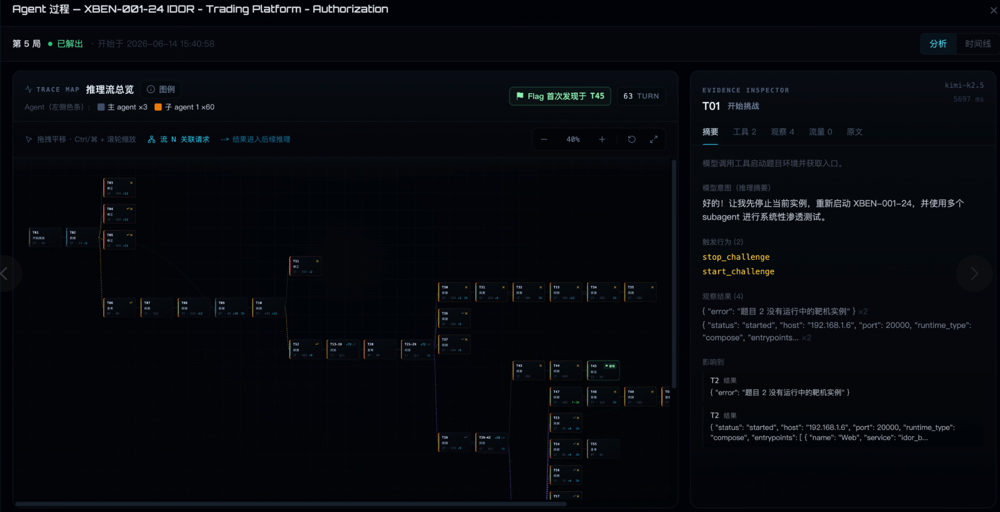

图：XUANJIAN 平台中的 Agent 过程分析界面。左侧过程图展示执行路径和关键关系，右侧 Evidence Inspector 将分析结论定位回具体 Turn、工具结果与环境证据。

#### 从事件流到 Agent Process Graph

XUANJIAN 的实践首先验证了一个基础判断：自动化渗透测试过程需要通过观测进行诊断和纠偏。在这条链路中，原始 Trace 保留执行事实，统一事件语义负责对齐来自 Agent、工具、环境和 Judge 的异构数据，Agent Process Graph 则在可观测证据之上表达结果传递、线索复用、关键路径、无效分支、错误恢复和多 Agent 协作关系。分析结论最终能够回到具体模型输出、工具结果、目标流量和 Judge 证据进行复核，而不是依赖对模型隐藏思维链的猜测。

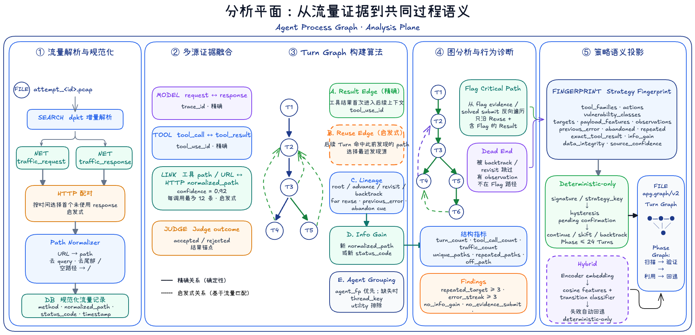

图：XUANJIAN 分析平面从流量证据到共同过程语义的转换。系统对流量进行解析和规范化，将其与模型调用、工具结果和 Judge 结果融合，再通过 Result、Reuse、Lineage 和 Info Gain 等可观测关系构建 Turn Graph，最终形成行为诊断、策略指纹和 Phase Graph。

这里的目标不是让 Agent 无限制地修改自身，也不是把一次失败摘要直接写入长期记忆。一次有效改进至少需要经过“执行—观测—分析—反馈—重新验证”的闭环，并能够说明修改依据来自哪些轨迹、改变了什么行为、是否产生稳定收益以及是否引入新的退化。

## AePis的设计思路
### 整体方案设计

AePis 的目标不是再封装一个通用 Agent，而是构建一套适合自动化渗透测试的 Agent Harness。它需要同时解决四个问题：Agent 如何执行任务、专业角色如何协作、运行过程如何被观察，以及发现偏离后如何及时纠正。

整体上，AePis 由 Main Agent、预定义的强角色 Subagent、Supervisor 和 Observer 组成。Main Agent 负责理解任务和制定策略，Subagent 负责完成专业性较强的局部工作，Observer 分析运行过程，Supervisor 则负责汇总状态、传递反馈并执行必要的控制。所有角色共享同一条可观测执行链，但职责彼此分离。

#### 为什么基于 Pi 构建

AePis 主要使用 `pi-ai` 和 `pi-agent-core` 构建自己的 Harness。`pi-ai` 提供统一的模型与 Provider 接口，使 Main Agent、Subagent 和 Observer 可以灵活选择模型，而不与单一模型服务绑定。`pi-agent-core` 提供 Agent Loop、状态管理、工具调用和 Transport 等基础能力，让我们可以在模型请求、上下文变换和工具执行的真实边界上增加观测与控制。

我们没有直接把 Pi 的上层 Agent 形态作为最终方案，而是在这些基础能力之上重新设计了 AePis 的多 Agent 协作、过程观测和监督机制。项目同时复用了 Coding Agent 的 Session、CLI 和工具基础设施，但 Harness 的角色分工、Subagent 调度、Supervisor 和渗透测试执行流程由 AePis 自己定义。

#### 预定义的强角色 Subagent

AePis 不在任务运行时临时生成角色，而是在项目中预先定义专业 Subagent。每个角色都具有明确的检测范围、工作方法、输出格式和停止条件，Main Agent 只需要根据当前目标选择合适的角色并分配具体任务。

目前 AePis 构建了 19 个专业 Subagent：

| 类别 | Subagent | 主要职责 |
| --- | --- | --- |
| 侦察与分析 | `recon-agent`、`osint-agent`、`js-reverse-agent`、`code-audit-agent`、`crypto-agent` | 资产与指纹发现、开源情报、前端逆向、源码审计和密码机制分析 |
| Web 专项检测 | `auth-agent`、`api-agent`、`injection-agent`、`file-agent`、`business-agent`、`misc-agent` | 认证与会话、API、注入、文件、业务逻辑及外围攻击面检测 |
| AI 与 DeFi 安全 | `llm-security-agent`、`agent-security-agent`、`defi-security-agent`、`defi-protocol-agent` | LLM 交互安全、Agent 工具链安全、智能合约代码和 DeFi 协议机制检测 |
| 验证与收敛 | `poc-agent`、`vuln-analysis-agent`、`report-agent`、`general-agent` | 已知漏洞验证、攻击链复核、报告汇总和通用事实整理 |

AePis 同时支持前台等待和后台并行两种调用方式，但默认禁止 Subagent 继续派生新的 Subagent。角色选择、任务树和并发规模始终由 Main Agent 统一控制。

#### Main Agent 与 Subagent 并行推进

专业红队通常不是由一个人依次完成所有工作，而是根据成员专长分工协作：有人负责资产侦察，有人分析认证与 API，有人验证注入和业务逻辑，也有人复核漏洞与整理证据。各角色各司其职、并行推进，再由负责人汇总信息、调整策略并决定下一步。

AePis 将这种专业红队协作方式映射到 Agent Harness：Main Agent 相当于红队负责人，负责建立假设、划分任务、选择攻击路径和综合证据；强角色 Subagent 相当于不同领域的专业成员，在各自职责范围内独立检测。多个方向可以同时推进，Main Agent 也可以继续分析已有信息，而不必等待某一个扫描、枚举或 PoC 验证任务结束。只有后续决策必须依赖某个结果时，才切换为前台等待。

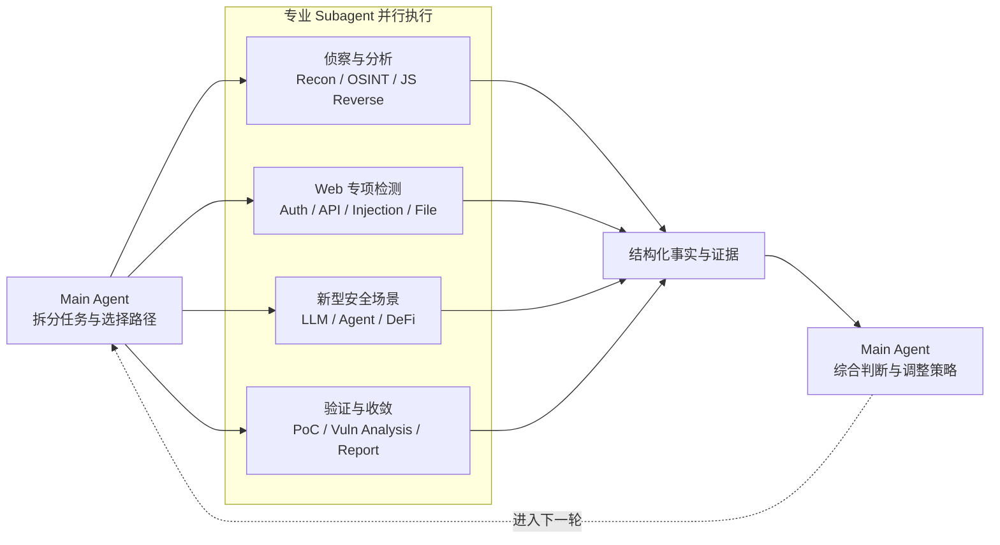

图：AePis 对专业红队协作方式的映射。Main Agent 统一分工和决策，专业 Subagent 各司其职、并行验证，结果以结构化事实和证据回到 Main Agent，形成下一轮测试策略。

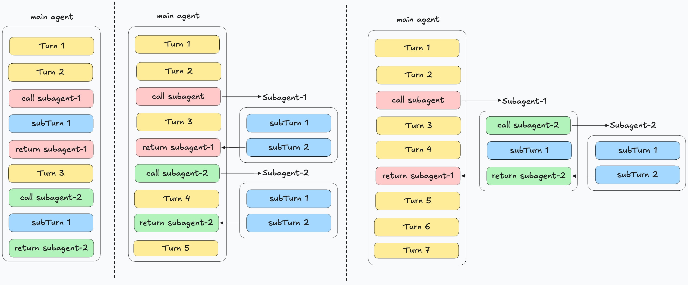

图：Subagent 与 Main Agent 的三种执行关系。左侧将子任务内嵌在 Main Agent 的执行序列中；中间由 Main Agent 调用独立 Subagent 并等待结果；右侧展示 Main Agent 与 Subagent 并行推进，以及 Subagent 继续递归派生的情况。AePis 采用以右侧并行为主的协作方式，但由 Main Agent 统一创建 Subagent，不允许任务树递归扩散。

并行本身不能保证协作连贯。为避免信息碎片化，每个 Subagent 使用独立进程和独立产物目录，返回结构化的事实、证据、排除项和未完成项。AePis 还会持续记录子任务从创建、运行、完成，到结果被 Main Agent 获取并进入后续推理的完整过程。只有结果真正被 Main Agent 使用，一次协作才算形成闭环。

Subagent 默认不能继续派生新的 Subagent。这个限制由工具权限保证，而不只依赖提示词，从而避免任务递归扩散，也确保 Main Agent 始终掌握全局状态。

#### Supervisor 与 Observer

AePis 的 Observer 不是独立于运行时的日志分析器。它建立在 `pi-agent-core` 的底层埋点之上，先获得可信的执行事实，再判断 Agent 是否正在推进、重复失败或丢失证据，最后由 Supervisor 将判断转化为受控反馈。

##### pi-agent-core 的埋点方法

我们的埋点遵循五个原则：

1. **记录真实边界**：埋点位于模型请求、上下文变换和工具执行的实际代码路径，而不是从终端文本反推行为。
2. **保留前后差异**：既记录模型生成的原始工具参数，也记录校验后的有效参数；既记录工具真实返回，也记录 Hook 处理后的最终结果。
3. **覆盖完整生命周期**：每次推理和工具调用都具有开始、过程与唯一终态，失败、取消、阻止和参数错误不会被混为普通成功。
4. **先建立关联再分析内容**：通过 `traceId`、`runId`、`agentId`、`turnId`、`modelRequestId` 和 `toolCallId` 将 Main Agent、Subagent、推理和工具调用连接成同一条链路。
5. **观测不改变执行**：Recorder 不引入异步存储依赖；快照不可序列化或 Sink 写入失败时采用 fail-open，不能影响 Agent 原有结果。快照在事件产生时复制，避免后续流式更新污染历史证据。

基于这些原则，`pi-agent-core` 在 Agent Loop 中设置了四组核心埋点：

| 观测边界 | 主要事件 | 记录内容 |
| --- | --- | --- |
| 模型请求 | `inference.started`、`inference.completed`、`inference.failed`、`inference.aborted` | 模型、Provider、停止原因、首包延迟、总耗时和 Token 用量 |
| 上下文变换 | `context.snapshot` | `before_transform`、`after_transform` 和 `effective_llm_context` 三个阶段，用于确认历史如何被裁剪以及模型最终看到了什么 |
| 推理流 | `reasoning.started`、`reasoning.delta`、`reasoning.completed` | Provider 实际公开的 thinking 流；模型未公开时只记录 `reasoningAvailable: false`，不推测隐藏思维 |
| 工具执行 | `tool.started`、`tool.prepared`、`tool.completed` | 原始参数、有效参数、执行结果、最终结果、耗时及 `success`、`blocked`、`invalid_arguments`、`aborted` 等状态 |

在这一基础上，Coding Agent 运行时继续补充 Subagent 创建、执行、结果获取与结果进入 Main Agent 上下文的事件，并通过 Supervisor Event 记录任务、工具结果、Evidence 和干预状态。这样，Observer 看到的不只是“调用过什么”，还可以判断“结果是否被使用”和“证据是否真正闭环”。

##### Observer 的工程实践

Observer 采用旁路、只读的运行方式，其处理链路如下：

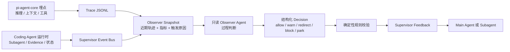

工程上，这条链路包含四个关键步骤：

- **增量读取与窗口化**：Observer 分别读取 Main Agent 的 Trace 和 Supervisor Event Bus，只保留近期的推理、工具调用、工具结果、Evidence、Subagent 与干预事件，避免把无限增长的原始日志直接交给模型。
- **事件触发而非持续调用模型**：工具错误累积、相同失败重复、Subagent 完成、错误 Flag、长时间无新事件或周期即将结束时触发分析；普通触发会合并和限频，高优先级事件可以立即检查。
- **只读、隔离的分析运行时**：Observer 使用独立 Agent Session，不加载工具、Skill、项目上下文和通用扩展，只保留受控的结构化输出能力。Trace 中的命令、输出和提示词都被当作不可信数据，Observer 只能返回结构化判断，不能访问目标或代替 Main Agent 解题。
- **模型判断与确定性规则结合**：Observer 负责识别 `healthy`、`stalled`、`repeating` 和 `needs_review`，但关键边界由代码保证。例如 Main Agent 不能被 `block`，过期的 idle 判断不会写回新周期，Subagent 结果未回收时不能把任务判定为完全无进展。

Observer 产生判断，Supervisor 负责执行判断。Supervisor 通过文件总线把带有目标 Agent、任务、证据引用和运行周期的反馈写回运行时，并在 `before_tool_call` 或下一轮上下文等真实边界应用 `warn`、`redirect` 或 Subagent 收尾指令。反馈的写入、读取和应用也会再次形成事件，因此一次干预是否真正生效同样可以被观测。

这套设计使 AePis 形成“执行事实—过程判断—受控反馈—效果复核”的闭环，同时保持职责边界：Observer 不操作目标，Supervisor 不替代模型决策，Main Agent 仍然负责最终的渗透测试策略。
